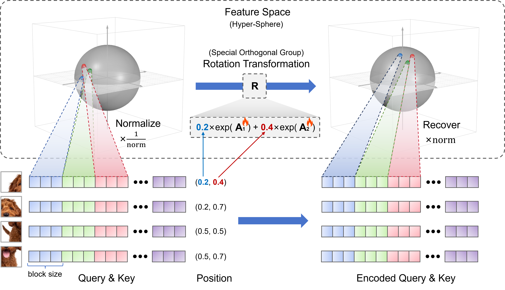
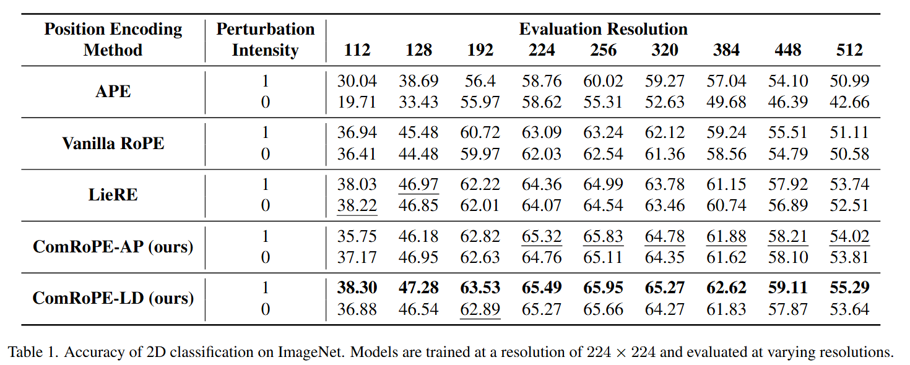
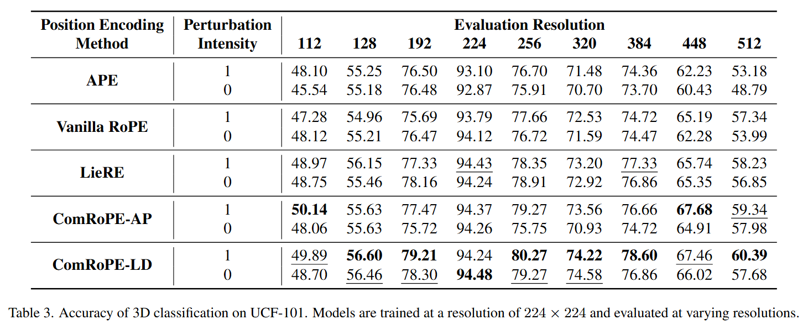
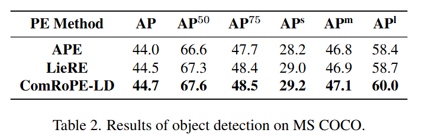
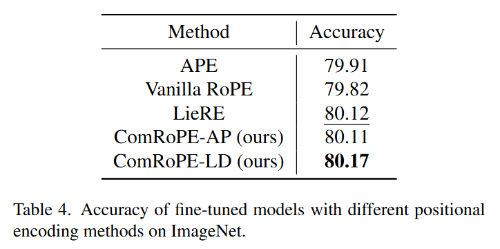

# ComRoPE

Official Implementation of the paper **ComRoPE: Scalable and Robust Rotary Position Embedding Parameterized by Trainable Commuting Angle Matrices** (coming soon).

# Introduction

## Overview

Overview of our method is shown as follows. Features are arranged into several blocks, each representing a distinct point in the feature space. The positions, along with the angle matrices, define the rotation matrix, which is an element of the special orthogonal group. The rotation transformation projects a feature point onto another point on the surface of the same hypersphere.

Formally, we define the angle matrices as follows:

$$
\left\lbrace
\begin{array}{l}
    \mathbf A_i = \mathrm{diag}(\mathbf B_{i1}, \mathbf B_{i2}, \cdots, \mathbf B_{im}) \\
    \mathbf B_{ij} \in \mathbb R^{b \times b} \quad\quad \forall j \in \lbrace 1, 2, \cdots, m \rbrace \\
\end{array}
\right.
$$

where the elements in $\mathcal B_j = \lbrace  \mathbf B_{1j}, \mathbf B_{2j}, \cdots,\mathbf B_{Nj}\rbrace $ are all skew-symmetric and pairwise commute with each other, i.e., $\mathbf B_{ij} \mathbf B_{ik} = \mathbf B_{ik} \mathbf B_{ij}$ for all $i \in \lbrace 1, 2, \cdots, N\rbrace $ and $j, k \in \lbrace 1, 2, \cdots, m\rbrace $.

## Solutions

We propose two solutions: ComRoPE-AP and ComRoPE-LD.

ComRoPE-AP defines the angle matrices as follows, where $\lbrace \mathbf P_j\rbrace _{j=1}^{m}$ represents a set of trainable matrices, $\mathbf O$ denotes a zero matrix, and $\equiv$ indicates congruence modulo:

$$
\mathbf B_{ij} =
  \left\lbrace
  \begin{array}{ll}
    \mathbf P_j - \mathbf P_j^\top, & \quad \text{if} \quad j\equiv i \pmod N \\
    \mathbf O, & \quad \text{otherwise}  \\
    \end{array}
    \right.
$$

ComRoPE-LD defines the angle matrices as follows, where a base matrix $\mathbf P$ and scaling factors $\lbrace \theta_i\rbrace _{i=1}^{N}$ are trainable:

$$
    \mathcal B = \lbrace \mathbf B_i = \theta_i (\mathbf P -\mathbf  P^\top)\; |\; i = 1, 2, \cdots, N \rbrace
$$

# Experiments

## 2D Classification on ImageNet-1K

## 3D Classification on UCF-101

## Object Detection on MSCOCO

## Fine-tuning with Pre-trained Weights

